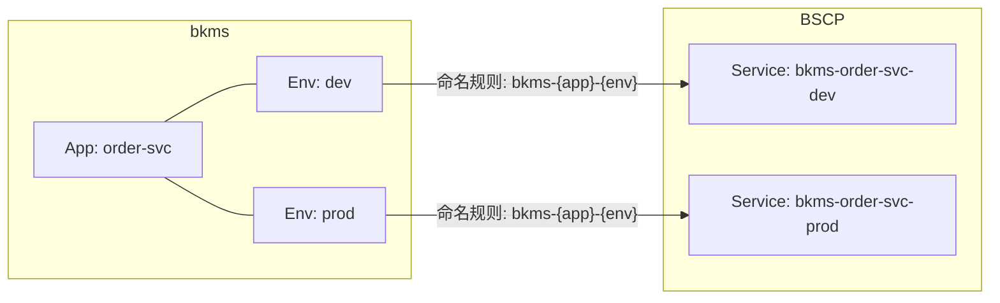
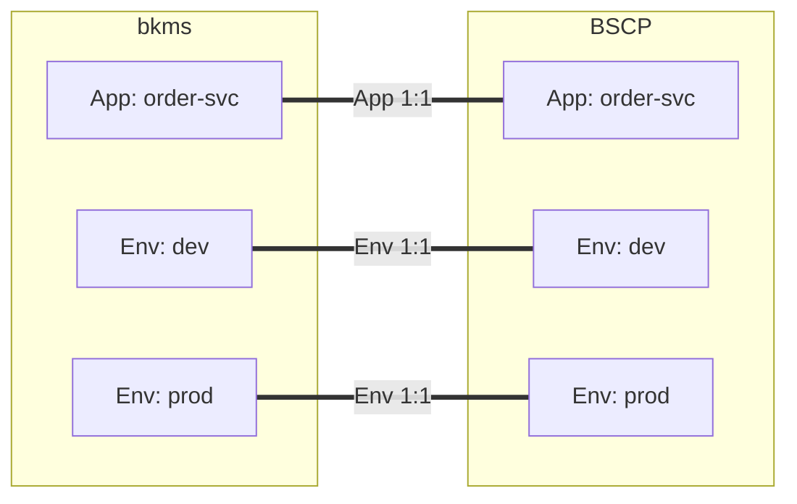

# 应用配置管理（bscpcfg）设计文档

## 设计背景

当前设计的核心目标是**简化实现，避免后续 BSCP 迁移时改动过大**。

BSCP（蓝鲸服务配置平台）后续会支持“环境”概念，届时 BSCP 的环境将与 bkms 的环境齐平。当前设计通过分层存储（Metadata + EnvBinding），预留了这一迁移路径，使得未来迁移时只需调整 EnvBinding 逻辑，不影响 Metadata。

### bkms 与 BSCP 的对应关系

| 阶段 | bkms 概念 | BSCP 概念 | 对应关系 | 实现方式 |
|------|-----------|-----------|----------|----------|
| **现阶段（一期）** | App + Env | Service（服务） | 1:1 | 通过命名规则 `bkms-{appName}-{envName}` 将每个 app+env 映射为一个独立的 BSCP Service |
| **未来（二期）** | App + Env | App + Env | 1:1 | BSCP 原生支持 App、Env 概念后，直接一对一映射 |

#### 现阶段：通过命名规则模拟环境隔离

由于 BSCP 当前**没有"环境"概念**，只有"服务（Service）"，bkms 采用**命名规则**作为特殊手法来实现 app+env 到 BSCP Service 的一对一映射：



**代码实现**（见 `service/manager.go` 中的 `getOrCreateFileService`）：

```go
fileServiceName := fmt.Sprintf("bkms-%s-%s", params.AppName, params.EnvName)
```

#### 未来：BSCP 原生支持 App + Env

待 BSCP 上线 App、Env 功能后，对应关系将变为完全一对一，无需命名规则模拟：



届时只需调整 EnvBinding 逻辑（不再需要 `getOrCreateFileService` 的命名规则），Metadata 保持不变。

---

## 领域概念

`bscpcfg` 包内部使用以下领域概念，**代码注释中直接使用这些概念名称**，不再使用"App 级"/"Env 级"等分层描述：

| 概念 | 说明 |
|------|------|
| **Metadata** | 应用的全局元信息（credential、mountPath、feedAddr），是所有环境绑定的前置条件。一个应用只有一条记录。 |
| **EnvBinding** | 某个具体环境的绑定配置（绑定了哪些下发服务）。一个 app+env 组合只有一条记录。 |
| **Snapshot** | Metadata + EnvBinding 的聚合视图（运行时使用，不持久化）。 |
| **ServiceRef** | 绑定的下发服务引用项（id + name）。 |
| **Store** | 统一存储接口，聚合 Metadata 和 EnvBinding 的 CRUD 操作。 |
| **Manager** | 业务管理器，封装 BSCP API 调用、Credential 管理和 Store 操作。 |
| **PodFragment** | 装配产出的 pod 片段（initContainers、sidecar、volumes、volumeMounts），待合并到完整 pod 中。由 `bscpcfg.Build` 产出。 |

### 概念间关系

```
Metadata(1) ──→ EnvBinding(N)
                    └── ServiceRef[]
```

- 必须先通过 `InitMetadata` 创建 Metadata，才能为该应用下的各环境创建 EnvBinding
- Snapshot 由 `Store.GetSnapshot` 或 Manager 组装产生，用于纯函数注入和对外返回

---

## 产品结论

### 1. 应用配置

- **一个环境一个默认下发服务**：创建 EnvBinding 时，自动通过命名规则 `bkms-{appName}-{envName}` 创建一个默认的 file 类型 BSCP Service
- **一期仅支持单服务配置拉取**：当前每个环境仅支持拉取 1 个 BSCP 服务的配置文件（即默认下发服务），不支持额外绑定公共服务。后续 BSCP 支持多服务配置合并下发后再扩展
- **一期**：每个环境都需要手动启用（先 InitMetadata，再 CreateEnvBinding）
- **二期**：BSCP 原生支持 App+Env 后，环境可自动启用
- **挂载路径**：用户在页面填写的路径就是实际挂到容器中的路径（平台通过 BSCP 后置脚本实现），不需要写入挂载路径的环境变量
- **配置文件归集**：应用所有的配置文件，都放到这 1 个服务中

### 2. 公共配置

- **一期先不做**，等 BSCP 支持环境后再讨论
---

## pod 片段装配 (bscpcfg)

`workload/bscpcfg` 包提供配置管理的 pod 片段装配能力（底层借助 BSCP 渠道下发配置）。装配产出的 `PodFragment` 包含以下 K8s 对象：

```yaml
# init 容器：启动时拉取配置
# 注意：当前一期仅支持拉取 1 个 BSCP 服务的配置，app 字段为单个服务名
initContainers:
  - name: bscp-init
    image: mirrors.tencent.com/bscp/bscp-init:latest
    args: ['--file-cache-enabled=false']
    env:
      - { name: biz, value: "{bscpBizID}" }
      - { name: app, value: "{serviceName}" }        # 当前仅支持单个服务名
      - { name: feed_addrs, value: "{feedAddr}" }
      - { name: token, value: "{token}" }
      - { name: temp_dir, value: "{mountPath}" }
    volumeMounts:
      - { mountPath: "{mountPath}", name: bscp-temp }

# sidecar 容器：运行时持续监听配置变更
containers:
  - name: bscp-sidecar
    image: mirrors.tencent.com/bscp/bscp-sidecar:latest
    args: ['--file-cache-enabled=false']
    env: [同 init 容器]
    volumeMounts:
      - { mountPath: "{mountPath}", name: bscp-temp }

# 主容器 volumeMount（共享配置目录）
containers:
  - name: "{mainContainerName}"
    volumeMounts:
      - { mountPath: "{mountPath}", name: bscp-temp }

# 共享 Volume
volumes:
  - { name: bscp-temp, emptyDir: {} }
```

---

## Credential 管理

- 每个业务（bizID）下只有一个 Credential，固定名称为 `bkms-credential`
- InitMetadata 时自动获取或创建 Credential
- CreateEnvBinding 时自动刷新 Credential 的 Scope（增量 diff：新增/修改/删除）
- Scope 规则：每个 BSCP 服务 + `/**`（表示所有路径）

---
