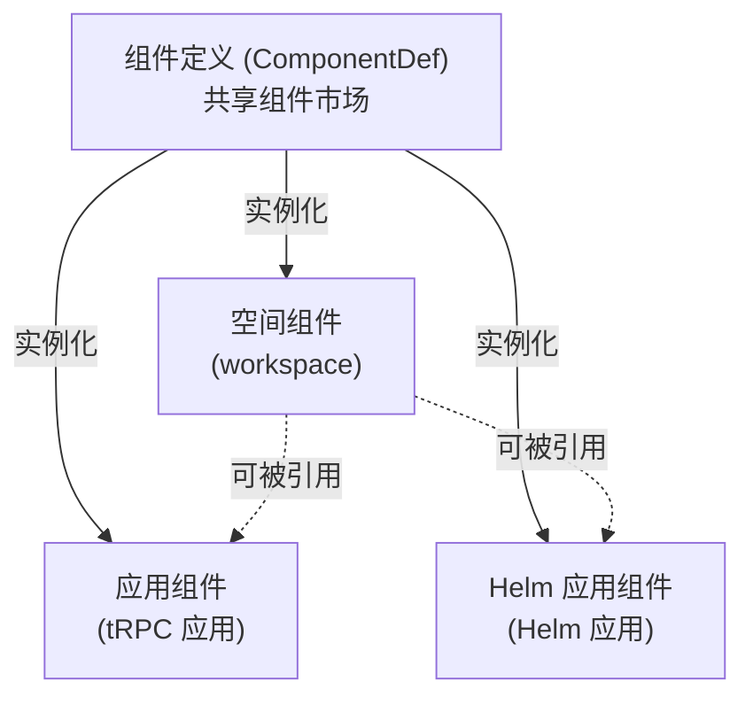
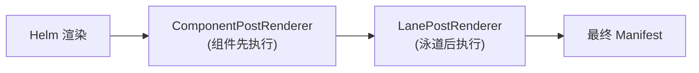
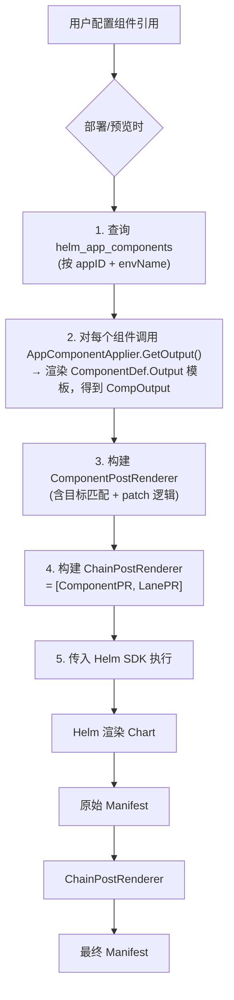

# Helm 应用组件（HelmComponent）

本文档说明 Helm 应用如何通过组件能力，在不修改原始 Chart 的前提下对渲染后的资源进行 Patch。

## 设计理念

Helm 应用组件的核心思路是**复用现有组件体系，通过 Helm PostRenderer 扩展点将组件市场能力延伸到 Helm 场景**。

设计原则：

1. **组件定义共享** — Helm 组件与 tRPC 应用组件共享同一套 ComponentDef 和组件市场，不重复建设
2. **关注点分离** — 组件 Patch 与泳道标签注入解耦为独立的 PostRenderer，通过链式组合协同工作
3. **精确匹配** — 使用 `apiVersion + kind + name` 三元组定位目标资源（类似 HPA scaleTargetRef）
4. **预览一致** — 组件效果在 DryRun 预览和实际部署中完全一致

## 与现有组件系统的关系



**关键区别**：

| 维度       | tRPC 应用组件                       | Helm 应用组件                            |
|----------|---------------------------------|--------------------------------------|
| 存储位置     | 内嵌在 AppModel 文档中                | 独立 collection（`helm_app_components`） |
| 生效时机     | 应用模型渲染阶段                        | Helm PostRenderer 阶段                 |
| 目标资源     | 固定为应用的工作负载                      | 通过 TargetResourceSelector 指定任意资源     |
| Patch 算法 | Strategic Merge Patch（有 schema） | JSON Merge Patch（无需 schema）          |

## 核心概念

### 目标资源选择器（TargetResourceSelector）

每个 Helm 组件引用绑定一个目标资源选择器，指定"用这个组件的输出去 Patch 哪个资源"：

```
TargetResourceSelector:
  apiVersion: apps/v1      # 可选，为空时不参与匹配
  kind: Deployment         # 必填
  name: my-nginx           # 必填
```

如果需要 Patch 多个资源，通过添加多个组件引用实现（一个引用 = 一个目标 + 一份 patcher）。

### 链式 PostRenderer（ChainPostRenderer）

Helm SDK 只支持设置单个 PostRenderer，通过 ChainPostRenderer 组合模式解决：



执行顺序的设计考量：

- 组件 PostRenderer 修改资源内容（注入 sidecar、追加资源等）
- 泳道 PostRenderer 注入流量标签
- 泳道后执行确保组件追加的新资源也能获得泳道标签

### 组件引用模式

与 tRPC 应用组件一致，支持两种引用方式：

| 模式                   | 说明                             | 适用场景         |
|----------------------|--------------------------------|--------------|
| ComponentInst（直接实例化） | 指定 type + version + properties | 应用独有的组件配置    |
| ComponentRef（引用空间组件） | 通过 refWorkspaceCompName 引用     | 多应用共享同一份组件配置 |

## 使用场景

| 场景         | 说明                                                 |
|------------|----------------------------------------------------|
| Sidecar 注入 | 向工作负载注入日志采集、服务网格代理等 sidecar 容器                     |
| 资源追加       | 追加 ConfigMap/Secret 并挂载到工作负载的 envFrom/volumeMounts |
| 字段 Patch   | 修改 annotations、resource limits、环境变量等任意字段           |
| 效果预览       | 部署前通过 DryRun 完整展示所有组件的 Patch 效果                    |

## 数据流



## 错误处理策略

| 情况                     | 行为            |
|------------------------|---------------|
| 目标资源不存在（selector 匹配不到） | 警告，不阻断部署      |
| Patch 执行错误（YAML 解析失败等） | 阻断部署，返回明确错误信息 |
| 组件定义不存在                | 阻断部署，提示组件定义缺失 |

## 相关文档

- 组件系统总体设计：[component.md](./component.md)
- Helm 部署设计：[helm_deploy.md](./helm_deploy.md)
