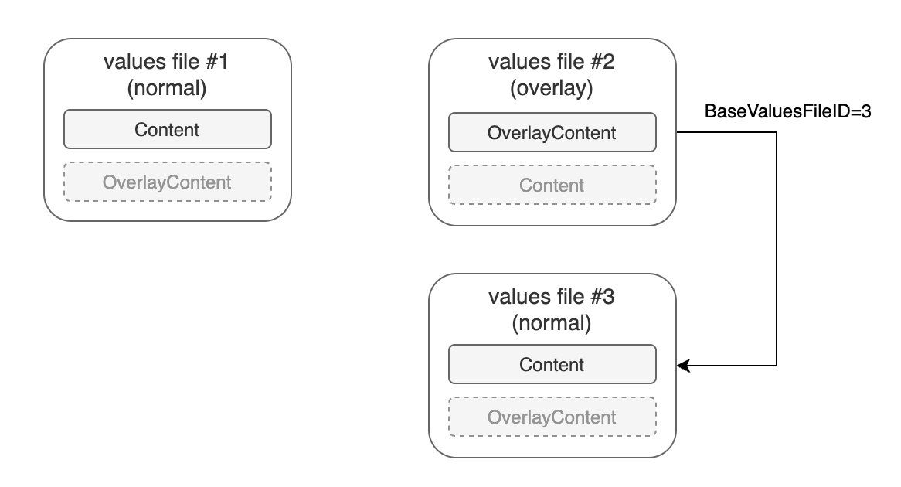
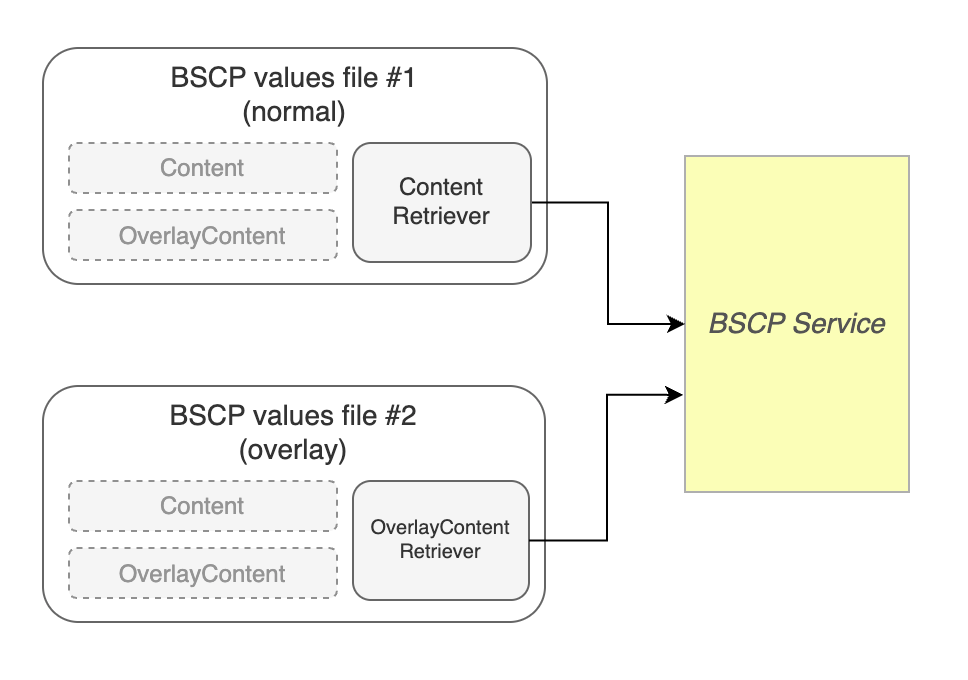
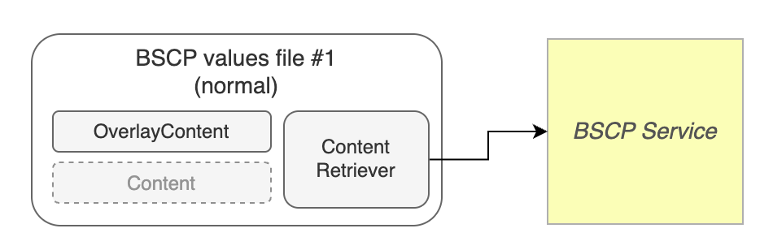

# ValuesFile 设计文档

ValuesFile 是一个通用的配置文件存储模型，支持多种应用类型：

- **Helm 应用**：存储 Helm values 文件，支持多 values 文件
- **tRPC 应用**：存储 tRPC 配置文件（如 trpc_go.yaml），支持分环境配置覆盖

## 基本概念

### values 文件

values 文件和应用之间是一对多关系。对于 Helm 应用，每个 values 文件都可以被用来生成一个新的 Release；对于 tRPC 应用，values 文件存储应用的配置内容，支持按环境进行差异化配置。

values 文件有几个关键属性：

- 类型（Type）：决定该文件存储内容的方式，比如覆盖层类型（overlay）通常需要依赖于另一个 values 文件，才能获取完整内容；
- 内容源（ContentSource）：决定文件内容来自与哪里，比如 BSCP 内容源表示其内容来自于 BSCP 系统。

视这些关键属性的不同，一份 values 文件支持的功能和操作会有所区别，这会在文档后面详细说明。

## 设计说明

### 两种内容格式：普通（Content）或覆盖（OverlayContent）

应用的 values 文件以前只有一种内容格式，就是最常见的 values YAML，可以被直接用来渲染生成 Release。如今，为了简化 values 文件的内容管理，引入一种新的内容格式：“覆盖（OverlayContent）”。

这两种格式的说明如下：

1. 普通（Content）：平平无奇，最常见的 values YAML；
2. 覆盖（OverlayContent）：是 YAML 但并内容并不是普通 values，而是包含针对 values 的一些覆盖字段（比如“补丁” patches），它需要和另一份普通内容一起渲染，才能产生一份可用的普通内容。

举个例子，下面是一份普通 values 内容：

```yaml
global:
  image: myapp:latest
  replicas: 3
  env: development
```

这是一份与之相关的覆盖 values 内容：

```yaml
patches:
- global:
    image: myapp:v2.0
- global:
    env: production
- global:
    replicas: null
```

将这份覆盖 values 与普通 values 内容合并，就可以得到下面这份新的 values：

```yaml
global:
  image: myapp:v2.0
  env: production
```

> 内部原理：采用 merge patch 算法将覆盖内容中 patches 字段里的所有补丁，应用到普通内容上。

这套“普通+覆盖”的双内容格式，能有效解决多个 values 文件可能存在大量相似内容，仅几个字段有区别的问题。对这类场景，只需设计一份“普通”内容作为基础，额外维护几个简单的“覆盖”内容即可。

### values 文件：类型和内容格式基本说明

`entities.go` 中的 `ValuesFile` 结构体是用来表示 values 文件的主要模型，它有**两个**可选的内容字段：Content 和 OverlayContent。

对于内容源是“本地（local）”的文件来说，这两个内容字段总是只有一个有值，且和当前文件类型息息相关。

- Content：仅类型为普通（normal）时有值
- OverlayContent：仅类型为覆盖层（overlay）时有值

覆盖层类型的 values 文件，无法仅通过 OverlayContent 获取完整内容，还需要通过 `BaseValuesFileID` 字段访问另一个文件，读取其基础内容，合并渲染后才能获得完整 values。

示意图：



- 图中的 3 个 values 文件，每一个都可以作为正常  values 文件使用。
- 其中文件 #2，是以文件 #3 为基础的类型为“覆盖层（overlay）”的特殊文件，使用它时，需要访问 #3 进行合并渲染。

看完以上设计，你可能有一个疑问：既然文件已通过类型表明了自身将使用哪种内容格式，为什么要让每个文件拥有两个内容字段（Content + OverlayContent），而不是仅保留一个 Content 字段，其内容格式随文件类型而变化？

这是因为，除了本地内容源以外，产品还需要支持其他外部内容源（比如 BSCP）。而在使用外部内容源时，**即使普通类型的 values 文件，也可能需要用到覆盖内容（OverlayContent）字段。**

### BSCP 内容源和内容格式说明

BSCP 内容源，表示 values 文件的内容主要来自外部 BSCP 平台的配置项，对于这类文件，其 `ValuesFile` 模型的内容字段，默认不在本地保存任何内容，而是总是从外部系统读取。

如下图所示：



- Content 和 OverlayContent 总是为空
- 总是通过 Retriever 访问外部系统，获取内容

默认情况下，BSCP 内容源的 values 文件都是只读，并不支持修改。但是，这无法满足一些特定场景。比如在对应用进行编排时，虽然基础 values 来自 BSCP，但我们必须对部分字段值如 image 的值进行调整。

为了适配这类场景，我们需要允许对这类文件内容进行一定调整。而这，是通过修改对象的 OverlayContent 字段，添加“覆盖内容”来完成。

如下图所示：



- 填充 OverlayContent 字段，和来自外部 BSCP 的内容共同渲染生成完整 values

虽然同用到 OverlayContent，但这类文件和“覆盖层”类型的本地内容源文件有较大区别。它并不需要使用 `BaseValuesFileID` 去引用另一个外部 values 文件，只靠自身就能生成完成 values。

### values 文件编辑适配（editor）模块

对 values 文件而言，其类型、内容格式、内容源类型之间存在各种复杂搭配：

- 两种基础类型：普通（normal）和覆盖层（overlay）
- 每个对象拥有两个内容字段：普通内容（Content）和覆盖内容（OverlayContent）
- 两种数据源：本地（local）和 BSCP
- 对于本地数据源文件，普通类型对应使用 Content，覆盖层类型对应使用 OverlayContent
- 对于 BSCP 数据源文件，两个内容字段默认都不使用，而是通过 Retriever 去远程拉取对应内容
- 普通类型的 BSCP 数据源文件，需要支持设置 OverlayContent，以支持对原内容做一定程度的“修改”

鉴于此，客户端在操作和编辑各种不同类型的 values 文件时，需关注以下内容：

- 当前文件是否支持编辑？
- 当前文件的哪个字段支持编辑？
- 如果被编辑的是一个 OverlayContent，哪里能找到它的基础内容？
- ……

相关的详细设计，可在 editor.go 源码中找到。
