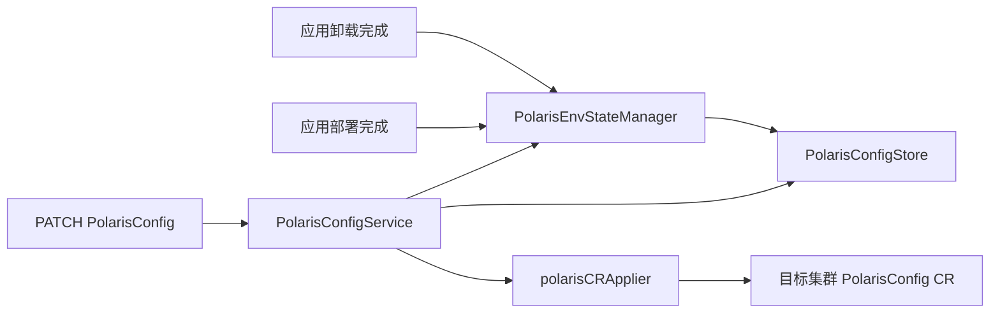
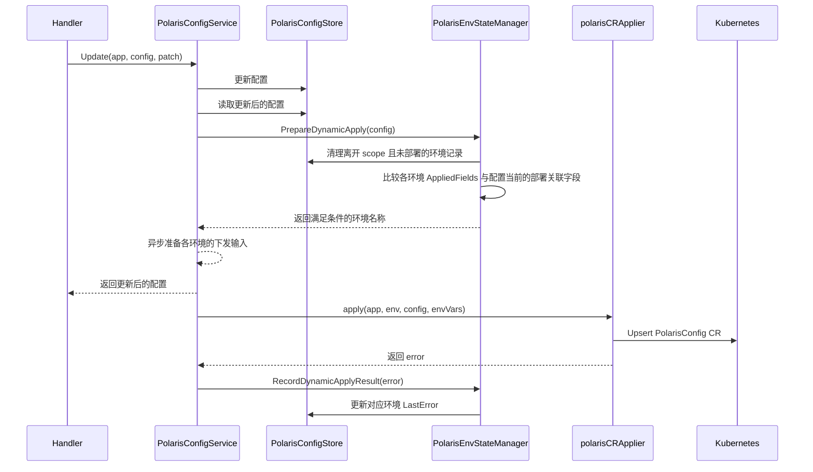

# PolarisConfig 动态下发设计

## 1. 设计目标

PolarisConfig 同时参与工作负载构建和 PolarisConfig CR 构建。配置修改后，系统需要根据字段的实际生效方式决定处理路径：

- 不影响工作负载的修改，可以直接更新目标集群中的 PolarisConfig CR；
- 影响工作负载的修改，必须等待应用重新部署，由部署流程统一下发完整资源。

动态下发的安全条件由每个环境中已经部署生效的字段决定。系统不维护额外的流程状态，而是在每次 PATCH 后使用当前配置和环境快照实时计算。

## 2. 字段分类

### 2.1 部署关联字段

以下字段会影响容器环境变量、容器端口或 Service，要求应用重新部署：

| 字段 | 影响 |
| --- | --- |
| `instanceKey` | 决定 Polaris 环境变量名称 |
| `polarisToken` | 写入容器环境变量，同时写入 PolarisConfig CR |
| `servicePort` | 写入容器端口、Service 和 PolarisConfig CR |

三个字段组成部署快照：

```go
type RedeployRequiredFields struct {
    InstanceKey  string
    PolarisToken string
    ServicePort  int32
}
```

### 2.2 可动态生效字段

以下 PATCH 字段只影响 PolarisConfig CR，可以在满足安全条件时动态下发：

- `direct`
- `keepNotReadyPod`
- `enableHealthCheck`
- `weight`
- `serviceLabels`

一次 PATCH 可以同时修改两类字段。系统不分析请求中具体修改了哪些字段，只比较 PATCH 完成后的部署关联字段与环境快照。

## 3. 动态下发判定

对配置 `config` 和环境 `env`，定义：

```text
DesiredFields = config 中当前的 instanceKey、polarisToken、servicePort
AppliedFields = config.EnvStates[env].AppliedFields
```

仅当以下条件全部成立时，该环境可以动态下发：

```text
env 属于 config.ScopeEnvNames
AND AppliedFields != nil
AND AppliedFields == DesiredFields
```

其他情况均等待应用部署。

这个判定具有以下性质：

- 首次部署前没有 `AppliedFields`，任何 PATCH 都不会直接操作集群；
- 只修改可动态生效字段时，部署快照仍然相等，可以直接更新 CR；
- 修改任一部署关联字段后，快照不再相等，必须重新部署；
- 如果用户把部署关联字段恢复为集群中的值，下一次 PATCH 会重新满足动态下发条件；
- 某次动态下发失败后，后续 PATCH 仍按同一条件重新计算，不需要单独的失败状态。

## 4. 环境快照

PolarisConfig 使用环境名作为 key 保存环境级信息：

```go
type PolarisConfig struct {
    // 其他配置字段省略
    EnvStates map[string]PolarisEnvState
}

type PolarisEnvState struct {
    AppliedFields *RedeployRequiredFields
    LastError     string
    UpdatedAt     time.Time
}
```

各字段语义如下：

- `AppliedFields`：最近一次应用部署实际下发到该环境的部署关联字段；为 `nil` 时表示尚无成功部署快照；
- `LastError`：最近一次记录的异步动态下发错误；应用部署完成后清空；
- `UpdatedAt`：环境信息最后更新时间，由 Store 统一生成。

创建配置时不需要为 scope 中的环境预建记录。读取不存在的 key 会得到 `PolarisEnvState` 零值，其 `AppliedFields` 同样为 `nil`，动态下发判定无需区分“记录不存在”和“记录存在但尚未部署”。

`AppliedFields` 保存集群侧事实，`LastError` 保存异步执行结果；`EnvStates` 不复制配置期望值，期望值始终直接取自 PolarisConfig 当前字段。

## 5. 组件职责



### 5.1 PolarisConfigService

`PolarisConfigService` 是配置变更的领域入口：

- 创建配置，并按请求决定是否创建平台托管的北极星服务；
- 更新配置，重新读取持久化后的完整对象，再调用环境状态管理器计算目标环境；
- 为目标环境读取 AppModel、Environment 和环境变量，异步调用资源下发器；
- 将每个环境的下发结果交回环境状态管理器记录；
- 删除配置，并处理平台托管北极星服务的生命周期。

Service 负责动态下发的流程编排，但不包含资源构建算法和环境状态算法。平台托管服务的创建、删除和实例查询由 `PolarisPlatformManager` 封装。

### 5.2 PolarisEnvStateManager

`PolarisEnvStateManager` 负责环境快照算法和持久化：

- PATCH 后清理无效记录并返回可以动态下发的环境名称；
- 记录每个环境最近一次动态下发的结果；
- 应用部署完成后记录新的 `AppliedFields`；
- 应用卸载完成后删除对应环境的快照；
- 清理由 scope 变化产生、且没有部署事实的环境记录。

Manager 不持有请求级可变状态，可以同时被 API Service 和 AppModel Deployer 注入使用。它不读取 AppModel、Environment 或环境变量，也不触发 Kubernetes 操作。

### 5.3 polarisCRApplier

`polarisCRApplier` 负责单次动态下发：

- 调用与应用部署相同的 Polaris 资源构建函数；
- 从构建结果中提取 PolarisConfig CR；
- 解析目标集群的 GVR 并执行 Upsert。

Applier 的输入由 Service 准备，只包含 Application、Environment、PolarisConfig 和完整环境变量。Applier 不持有任何 Store，不读取或写入 `EnvStates`，只返回本次资源构建或集群操作的错误。只有完整应用部署完成后，才能更新部署快照。

## 6. PATCH 调用链



PATCH 接口只等待配置保存和动态下发条件计算，不等待集群操作完成。因此响应中的
`envStates.lastError` 可能尚未反映本次异步任务结果，最新结果需要重新请求列表接口获取。

Service 先按应用读取一次 AppModel，再逐环境执行：

1. 读取 Environment；
2. 构建该环境的完整变量上下文；
3. 构建 PolarisConfig CR 和 Service；
4. 从结果中提取 PolarisConfig CR；
5. 获取目标集群 PolarisConfig GVR；
6. Upsert CR；
7. 将成功或错误结果交给环境状态管理器。

单个环境失败不会中断其他环境。AppModel 读取失败时，本批环境均记录同一错误。

动态下发成功时清空 `LastError`，失败时写入错误；两种结果都不修改 `AppliedFields`。CR Upsert 成功不能代表工作负载已经使用了新的部署关联字段，因此也不能更新部署快照。

## 7. 部署与卸载后的同步

### 7.1 应用部署完成

AppModel Deployer 完成额外资源、主工作负载和过期资源处理后，调用：

```go
PolarisEnvStateManager.ReconcileAfterDeploy(ctx, app, env)
```

Manager 遍历应用下的 PolarisConfig：

- 配置仍在该环境生效时，将配置当前的部署关联字段写入 `AppliedFields`，清空 `LastError`；
- 配置已不在该环境生效时，删除该环境的 `EnvState`。

这一步发生在完整资源下发后，因此 `AppliedFields` 表示已经由部署流程处理过的配置，而不是一次动态 CR 更新的结果。

### 7.2 应用卸载完成

环境卸载完成后，Deployer 调用：

```go
PolarisEnvStateManager.ReconcileAfterUninstall(ctx, app, envName)
```

Manager 从应用下所有 PolarisConfig 中移除该环境的 `EnvState`。再次部署该环境时，将重新建立部署快照。

部署和卸载的主体操作已经完成后才执行上述同步；同步错误会被记录日志，不改变部署或卸载的最终结果。

## 8. Scope 变化与配置删除

### 8.1 环境加入 scope

新加入的环境通常没有 `AppliedFields`，因此等待该环境下一次应用部署。部署完成后创建快照，后续可动态下发。

### 8.2 环境离开 scope

- 没有部署快照的环境记录可以立即清理；
- 已有部署快照的环境记录暂时保留，表示集群中可能仍存在该配置生成的资源；
- 该环境下一次应用部署时，资源差异清理会删除不再生成的资源，随后 `ReconcileAfterDeploy` 删除环境快照。

如果环境在下一次部署前重新加入 scope，已有的 `AppliedFields` 仍可用于动态下发判定。

### 8.3 删除整条配置

删除配置时直接删除 PolarisConfig 记录。集群中由该配置生成的资源由应用下一次部署根据资源差异清理，不保留配置级删除状态。

## 9. Store 更新语义

环境信息通过以下接口维护：

```go
UpsertEnvState(ctx, appID, configName, envName, update)
RemoveEnvStates(ctx, appID, configName, envNames)
```

`UpsertEnvState` 使用 `envStates.<envName>` 定位记录，只更新调用方提供的字段，并自动刷新 `UpdatedAt`。`RemoveEnvStates` 使用一次 `$unset` 批量删除环境信息；传入空列表或重复删除仍然成功。

环境名作为 MongoDB 子文档字段名。环境名称校验不允许 `.` 和 `$`，可以安全用于字段路径。

## 10. API 表达

列表接口和 PATCH 接口沿用 `envStates` 对象，并在每个环境信息中增加后端计算的 `status`：

```json
{
  "envStates": {
    "stag": {
      "appliedFields": {
        "instanceKey": "demo",
        "polarisToken": "******",
        "servicePort": 8080
      },
      "polarisTokenChanged": false,
      "lastError": "",
      "updatedAt": "2026-07-27T08:30:00Z",
      "status": "deployed"
    }
  }
}
```

状态按以下规则计算：

| 条件 | `status` |
| --- | --- |
| scope 内且没有环境记录或部署快照 | `pendingCreate` |
| scope 内且 `instanceKey`、`polarisToken` 或 `servicePort` 与部署快照不同 | `pendingModify` |
| scope 内且部署关联字段与快照一致 | `deployed` |
| scope 外但仍有部署快照 | `pendingDelete` |

scope 内没有环境记录时，响应会补充一条 `appliedFields: null`、`polarisTokenChanged: false`、
`lastError: ""`、`updatedAt: ""` 的 `pendingCreate` 信息。没有相关环境时，`envStates` 返回空对象
`{}`，不返回 `null`。

`lastError` 保持原有语义，不参与 `status` 计算。`appliedFields.polarisToken` 固定返回 `******`，
前端继续通过 `polarisTokenChanged` 判断 Token 是否变化。

## 11. 关键行为矩阵

| 场景 | 是否动态下发 | 后续处理 |
| --- | --- | --- |
| 首次部署前修改配置 | 否 | 等待应用部署 |
| 已部署后只修改 `weight` 等 CR 字段 | 是 | 异步 Upsert CR |
| 修改 `instanceKey`、`polarisToken` 或 `servicePort` | 否 | 等待应用部署更新完整资源和快照 |
| 部署关联字段恢复为 `AppliedFields` | 是 | 下一次 PATCH 重新满足判定 |
| 新环境加入 scope | 否 | 该环境首次部署后建立快照 |
| 已部署环境离开 scope | 否 | 下一次该环境部署时清理资源和快照 |
| 环境卸载 | 不适用 | 卸载完成后删除该环境快照 |
| 删除整条配置 | 不适用 | 下一次应用部署通过资源差异删除集群资源 |
