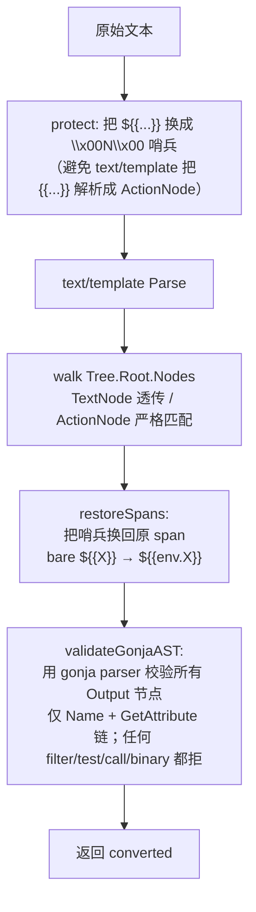

# 新 Render 模块与存量数据迁移

本文介绍新模板渲染模块的设计和迁移

相关文件清单：

```text
pkg/core/render/     # 模板渲染与存量模板迁移能力
├── context.go  # Context 渲染上下文（namespace）相关
├── gonja.go    # Gonja 配置 + renderGonja 渲染入口
├── render.go   # 渲染入口 + RenderGoTemplate / RenderShellVars 两个待迁移的函数
└── migrate/    # 迁移相关

cmd/migration/
├── migrate_render_template.go    # 父命令
├── migrate_render_generate.go    # generate 子命令
└── migrate_render_apply.go       # apply 子命令
```

---

## 1. 新旧 Render 模块对比

### 旧版 Render 模块

| Syntax                | Type                       | Implementation                        | Usage                                      |
| --------------------- | -------------------------- | ------------------------------------- | ------------------------------------------ |
| `{{ .BKMS.ENV.X }}`   | Environment Variable       | `text/template` (Go Template)         | Taf app config / component property values |
| `{{ .someProperty }}` | Component Property         | `text/template` (Go Template)         | Component define output template           |
| `{{ .bkmsAppName }}`  | Builtin Component Property | `text/template` (Go Template)         | Component define output template           |
| `${{BKMS_APP_NAME}}`  | Environment Variable       | Gonja (Gonja v2)                      | Taf app config / component property values |
| `${VAR}` / `$VAR`     | Environment Variable       | `os.Expand`   (Shell Style Variables) | Trpc shell variables                       |

### 新版 Render 模块

| Syntax                | Type                       | Implementation                        | Usage                                      | Note                      |
| --------------------- | -------------------------- | ------------------------------------- | ------------------------------------------ | ------------------------- |
| `${{ env.KEY }}`      | Environment Variable       | Gonja (Gonja v2)                      | Taf app config / component property values |                           |
| `${{ build.KEY }}`    | Build Variable             | Gonja (Gonja v2)                      | Helm values                                | Currently not implemented |
| `${{ input.KEY }}`    | Input Variable             | Gonja (Gonja v2)                      | Component define output template           | Currently not implemented |
| `${{ builtin.KEY }}`  | Builtin Variable           | Gonja (Gonja v2)                      | Component define output template           | Currently not implemented |
| `{{ .someProperty }}` | Component Property         | `text/template` (Go Template)         | Component define output template           | To be migrated to gonja   |
| `{{ .bkmsAppName }}`  | Builtin Component Property | `text/template` (Go Template)         | Component define output template           | To be migrated to gonja   |
| `${VAR}` / `$VAR`     | Environment Variable       | `os.Expand`   (Shell Style Variables) | Trpc shell variables                       | To be migrated to gonja   |

---

## 2. 迁移目标语法

| 旧                                                                   | 新                       | scope                                                        |
| -------------------------------------------------------------------- | ------------------------ | ------------------------------------------------------------ |
| `{{ .BKMS.ENV.X }}`                                                  | `${{env.X}}`             | Env                                                          |
| `${{X}}`（无命名空间）                                               | `${{env.X}}`             | Env                                                          |
| `${{env.X}}` 等已命名空间                                            | 不动                     | Env                                                          |
| `{{ .bkmsAppName }}`                                                 | `${{env.BKMS_APP_NAME}}` | Env（5 个历史 camelCase 内置变量转成 env.SNAKE_CASE）        |
| `{{ .<propName> }}`                                                  | 暂不迁移                 | **仅 Output**；本期 `component_defs.output` 仍走 Go template |
| `{{ .name }}`                                                        | 暂不迁移                 | **仅 Output**；本期 `component_defs.output` 仍走 Go template |
| `{{ raw "S" }}`                                                      | `S`（字面展开）          | 两种都允许                                                   |
| `{{ if/range/with/define }}`、`{{ x \| filter }}`、`{{ printf .. }}` | **不转换**，记失败       | —                                                            |

trpc Shell `${VAR}` / `$VAR` **本期不迁移**。

---

## 3. Convert 算法

实现在 [`pkg/core/render/migrate/convert.go`](../pkg/core/render/migrate/convert.go)。整体思想：**只解析、不渲染**。

### 流程



### 关键函数

只实现了 Env scope；Output scope 的转换函数没有写（compDef.Output 仍走 Go template，详见第 5 节）。

- `Convert(text)` — 唯一公开入口，走 Env scope。
- `protect(text)` — 顺序扫描 `${{...}}`，替换为 NUL 哨兵 `\x00<idx>\x00`。原文不会出现 NUL，所以哨兵安全。
- `walkGoTemplate(masked)` — `text/template.Parse` 后只接受：
  - `*parse.TextNode`：原样输出（含哨兵）。
  - `*parse.ActionNode` 且 `Pipe.Decl == nil` 且 `len(Pipe.Cmds) == 1`：
    - 形如 `{{ .a.b... }}`（单 `*parse.FieldNode`） → 调 `mapEnvField`。
    - 形如 `{{ raw "S" }}`（`IdentifierNode("raw")` + `*parse.StringNode`） → 调 `emitRawLiteral`，字面展开。
  - 其它（`IfNode` / `RangeNode` / `WithNode` / `TemplateNode` / 多 cmd / 管道 / 函数调用…） → `ErrNeedsManual`。
  - `len(tmpl.Templates()) > 1` 也拦下（`{{ define }}` 会创建 associated template）。
- `mapEnvField(ident)`：
  - `.BKMS.ENV.X` → `${{env.X}}`。
  - 单段 camelBuiltin（如 `.bkmsAppName`） → `${{env.BKMS_APP_NAME}}`（5 个内置变量做 camel→SNAKE 映射）。
  - 其它 → `ErrNeedsManual`。
- `emitRawLiteral(s)` — 字面输出 `s`；若 `s` 含 NUL（说明原 raw 字符串里嵌了 `${{...}}`，迁移后会被 gonja 重新当变量），拒绝。
- `restoreSpans(text, spans)` — 用 `normalizeGonjaSpan` 把裸 `${{X}}` 归一为 `${{env.X}}`；已命名空间的不动。
- `validateGonjaAST(converted)` — 用 gonja parser 解析转换结果，遍历：
  - `*nodes.Data` OK。
  - `*nodes.Output`：`Condition`/`Alternative` 必须为 nil；`Expression` 必须是 `*nodes.Name` 或 `*nodes.GetAttribute` 嵌套链。
  - 见到 `*nodes.FilteredExpression` / `*nodes.TestExpression` / `*nodes.Call` / `*nodes.BinaryExpression` 等一律 `ErrNeedsManual`。

### 为什么要哨兵

`text/template` 看到 `${{X}}` 会把 `{{X}}` 当成 `ActionNode`：

- `${{VAR}}` → 解析时直接报 `function "VAR" not defined`
- `${{.x}}` → 解析为 `$` TextNode + `{{.x}}` ActionNode（语义被破坏）

无法通过 `Delims()` 区分（两者共享 `{{` 起始符），只能在 parse 前**屏蔽**所有 `${{...}}` 段。

### 为什么不做渲染对比

早期方案是"旧渲染 vs 新渲染结果一致"才认为转换正确。问题：

- 渲染对比依赖一个具体的 env/props 上下文，但同一 component 的多个 app 实例 × 多个 env 都得对比一遍才严格，复杂度爆炸。
- 如果不这么做，没有实例的组件无法完成迁移验证

AST 路径只接受**纯变量 + raw**两种节点类型，等价转换可以静态保证；任何"奇怪"的写法直接拒掉留给人审。

---

## 4. 迁移工具：generate → review → apply

CLI 入口 [`cmd/migration/migrate_render_template.go`](../cmd/migration/migrate_render_template.go)，注册到 [`cmd/root.go`](../cmd/root.go)：

```text
migrate_render_template
├── generate     # 扫描 MongoDB，写 drafts.yaml（含成功与失败条目）；不写 DB
└── apply        # 读 drafts.yaml，按 Kind 分派 typed handler 写 DB；staleness 不一致即跳过
```

### generate

[`cmd/migration/migrate_render_generate.go`](../cmd/migration/migrate_render_generate.go) 按 Kind 分别扫描：

| Kind                         | Collection                                        | 自然键                                | 备注                                                                                                                                                                                                       |
| ---------------------------- | ------------------------------------------------- | ------------------------------------- | ---------------------------------------------------------------------------------------------------------------------------------------------------------------------------------------------------------- |
| `componentDefDefaultValue`   | `component_defs`                                  | `(name, version, propertyName)`       | 仅 `properties[].defaultValue` 为 string 时扫                                                                                                                                                              |
| `appModelComponentProperty`  | `app_models`                                      | `(appID, componentName, propertyKey)` | `comp.Name` 为空的组件实例会跳过并打 warning（无法用自然键 apply）                                                                                                                                         |
| `workspaceComponentProperty` | `workspace_components`                            | `(_id hex, propertyKey)`              | `_id` 直接命中文档，无数组下标                                                                                                                                                                             |
| `appModelTafFileContent`     | `app_models`                                      | `appID`                               | `workload.tafConfig.fileContent`；历史兜底字段                                                                                                                                                             |
| `appConfigFileTaf`           | `app_config_files`（filter `format=taf`）         | `(_id hex, overlay)`                  | overlay=true → `overlayContent`，false → `content`                                                                                                                                                         |
| `appConfigFileVersionTaf`    | `app_config_file_versions`（filter `format=taf`） | `(_id hex, overlay)`                  | 必须迁；否则回滚旧版本会把 legacy 语法刷回 `app_config_files`                                                                                                                                              |
| `polarisConfigProperty`      | `polaris_configs`                                 | `(appID, name, propertyKey)`          | `propertyKey` ∈ `{instanceKey, polarisName, polarisNamespace, polarisToken, serviceLabels}`；`serviceLabels` 时 Original/Converted 是整张 map 的 JSON 字符串（与运行时 `ToComponent → json.Marshal` 对齐） |

每个字段统一走 `RunConvert`：

```text
HasTemplate=false   → skipped++（不落 Draft）
Convert err         → failed++  （仍落一条 Base.Error 非空的 Draft 供人工排查）
converted==original → skipped++
其它                → drafted++（落一条带 Converted 的 Draft）
```

Flags：

- `--srvCfg`（必填）
- `--drafts`（默认 `migrate_render_drafts.yaml`）

### review

人工编辑 `drafts.yaml`：

- 删除某个 entry → `apply` 时不会处理它（最直观的"我不要这条"）
- 转换失败的 entry（`error` 字段非空）默认会被 apply 跳过；review 时按需手工补 `converted` 字段并清空 `error` 即可参与 apply

### apply

[`cmd/migration/migrate_render_apply.go`](../cmd/migration/migrate_render_apply.go) 按 Kind 分派到 7 个 typed handler，每个 handler 用对应的强类型结构解码 + 自然键定位：

- staleness：先用强类型 `Decode`（`appmodel.AppModel` / `appcfg.AppConfigFile` 等）拿到当前值，再与 `Original` 字符串比对；不一致或字段已不存在都打 `[STALE]` 跳过。

Flags：`--srvCfg` / `--drafts`。**没有** `--dryRun`：dry-run 等价于"generate 完不 apply"。

---

## 5. 已知边界 / 限制

- **`component_defs.output` 不在本期迁移范围**：runtime [`evaluate.go`](../pkg/extension/component/evaluate.go) `GetOutput` 仍走 `RenderGoTemplate`（Go template），存量数据保持 `{{ .replicas }}` / `{{ .name }}` 写法不动。后续若要把 Output scope 也切到 Gonja，需要：
  1. 在 [`pkg/core/render/migrate/convert.go`](../pkg/core/render/migrate/convert.go) 里补 Output scope 的转换函数（`{{ .X }}` → `${{input.X}}` / `${{builtin.X}}`）。
  2. 把 `evaluate.go` 里 `RenderGoTemplate(compDef.Output, props)` 换成新版本渲染。
  3. 在 generate 里把 `scanComponentDefs` 改成同时扫 `output` 字段。
- **`app_config_file_versions` 已纳入扫描**：避免用户回滚到旧版本时，旧版本里的 legacy `{{...}}` 被重新写回 `app_config_files`。
- **多段 `.a.b` 字段（除 `.BKMS.ENV.X` 外）一律拒**：runtime 没有相应的嵌套数据；存量出现就是错。
- **trpc Shell `${VAR}` / `$VAR`** 不迁移；apm.go 里 `RenderShellVars` 仍旧。
- **`comp.Name` 为空的组件实例**：generate 阶段直接跳过并打 warning。apply 用 `arrayFilters({c.name: ComponentName})` 定位，空 name 会匹配到错位的实例，必须前置拦掉。

---

## 7. 执行迁移

```bash
# 本地端到端
./bkms-server migrate_render_template generate \
    --srvCfg /path/to/config.yaml \
    --drafts /tmp/d.yaml

# 人工 review /tmp/d.yaml，删除不希望迁移的 entries；error 非空的条目会被 apply 跳过

./bkms-server migrate_render_template apply \
    --srvCfg /path/to/config.yaml \
    --drafts /tmp/d.yaml

# 输出：applied / stale / errored 统计
# DB 改过的 entry → [STALE]，跳过；可重跑 generate，重复以上过程，直到完成迁移
```
