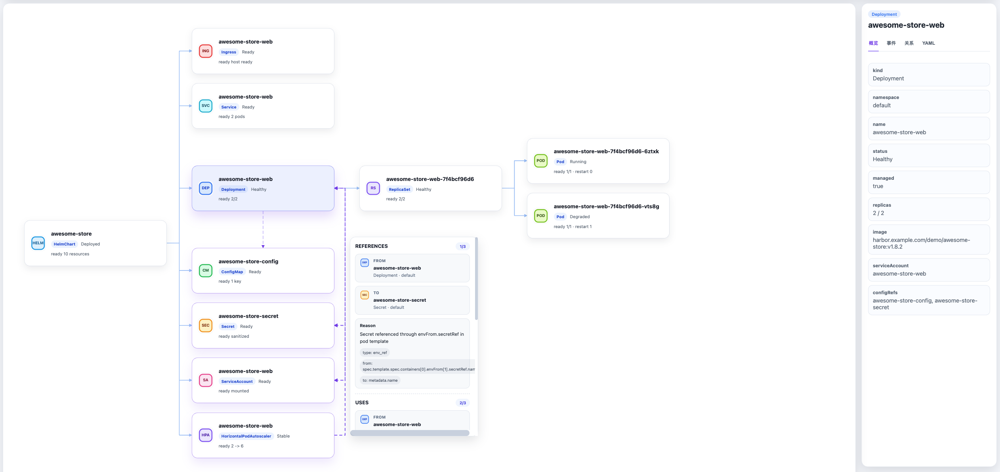

# 资源拓扑设计文档

## 1. 设计背景与目标

资源拓扑功能旨在为用户提供应用在特定环境（及泳道）下部署的 Kubernetes 资源关联视图。

核心目标：

- 边界清晰：仅展示当前应用部署所关联的资源，而非提供整个集群的通用资源浏览器。
- 性能与体验：主接口仅返回轻量级的节点和边数据（用于画图），不返回完整的 YAML Manifest，确保首屏加载速度。
- 异步刷新：拓扑的资源范围在部署成功后异步计算并持久化，查询时基于持久化的范围去集群拉取实时状态，避免查询接口过重。

页面功能示例：

节点间通过两种连线表达关系：

- 实线（主边）：表示管理/拥有关系，构成树状主干。例如 Deployment → ReplicaSet → Pod。
- 虚线（辅助边）：表示依赖关系。例如 Service 通过 label selector 选中 Pod，ConfigMap / Secret / ServiceAccount 被 Pod 挂载引用。

点击连线后弹出浮窗，展示该边的详细关系信息（如当前指向为多条边的公共部分，则展示多条关系）其内容包括：

- 关系类型标题：如 `SELECTS`、`MOUNTS`，对应辅助边的语义类型。
- FROM / TO：关系的来源资源和目标资源，附带 Kind 和 Namespace。
- Reason：解释这条边产生的原因。例如 "Service selector matched pod labels"，类型为 `label_selector`，并列出具体匹配的标签键值对（`app.kubernetes.io/name=awesome-store`、`app.kubernetes.io/component=web`），以及标签来源路径（`from: spec.selector` → `to: metadata.labels`）。

## 2. 核心架构与工作流

整个资源拓扑的实现分为 "写（刷新）" 和 "读（查询）" 两条链路：

### 2.1 异步刷新链路 (Refresher)

当应用部署（如 Helm 部署或 AppModel 部署）成功后，会触发异步的拓扑刷新任务：

1. 收集资源：从部署产物（如 Helm Manifest 或 AppModel 的 ResourceKeys）中解析出本次部署直接管理的 K8s 资源。
2. 提取关系线索：分析这些资源，提取出可复用的关系线索（如 `ownerReferences`、`labelSelector`、`volumeMounts`、 `Ingress backend` 等）。
3. 持久化存储：将收集到的"资源集合"和"扩展关系线索"作为一个 `ResourceSnapshot`（资源拓扑快照）对象，保存到 MongoDB 中。
    - 注意：这里存的不是最终的拓扑图，而是"构图所需的原材料"。
4. 乐观锁：在更新 MongoDB 中的 `ResourceSnapshot` 时，引入了 `DataVersion` 机制。防止多个并发的部署任务导致旧版本数据覆盖新版本数据

### 2.2 实时查询链路 (Builder)

当前端调用拓扑主接口时：

1. 加载快照：从 MongoDB 中读取该应用/环境对应的 `ResourceSnapshot`。
2. 并发获取状态：根据 `ResourceSnapshot` 中的资源清单，并发向 K8s 集群请求这些资源（以及管理的 Pod）的最新状态（限制并发数以保护 APIServer）。
3. 计算节点与边：
    - 节点 (Node)：将 K8s 资源状态统一为简明状态（如 `Running`、`Healthy`、`Degraded` 等），并提取少量关键信息（如 IP、镜像、端口）作为 `Extras`。
    - 边 (Edge)：基于 `ResourceSnapshot` 中保存的关系线索，结合集群中实际存在的资源，计算出节点间的连线。
4. 返回轻量数据：将计算好的节点和边返回给前端渲染。

## 3. 关键领域模型

### 3.1 ResourceSnapshot (资源拓扑快照)

存储在 MongoDB 的 `topology_resource_snapshots` 集合中，以 `appID + envName + trafficLaneName` 为唯一索引。
包含两个核心部分：

- `Resources`: 当前作用域下可见的资源清单（Kind, Namespace, Name）。
- `Relations`: 资源间的关系线索（如 A 通过 label_selector 关联 B）。

### 3.2 节点 (Node) 与 边 (Edge)

- 节点 ID：采用 `Kind/Namespace/Name` 的 Base64 编码，确保前端交互时的唯一性和稳定性。
- 主边 (Primary Edge)：用于构建拓扑的树状主干（如 Deployment -> ReplicaSet -> Pod），通常用实线表示。关系类型如 `MANAGES`, `OWNS`, `CREATES`。
- 辅助边 (Secondary Edge)：用于表达资源间的横向依赖（如 Service -> Pod, Ingress -> Service），通常用虚线表示。关系类型如 `SELECTS`, `MOUNTS`, `ROUTES_TO`。
- 边原因 (Edge Reason)：每条边都会携带 `Reason` 字段，向用户解释这条边是如何产生的（例如"通过标签 app=nginx 匹配"），方便排障。

## 4. 接口设计原则

- 按需加载：主接口 `/resource-topology` 只返回画图必须的最少字段。如果用户需要查看某个资源的详细事件或完整 YAML，需通过独立的详情接口获取。
- 统一状态：后端屏蔽了 K8s 复杂的 `conditions` 数组，直接向前端输出提炼后的布尔值或枚举状态，降低前端的渲染复杂度。
